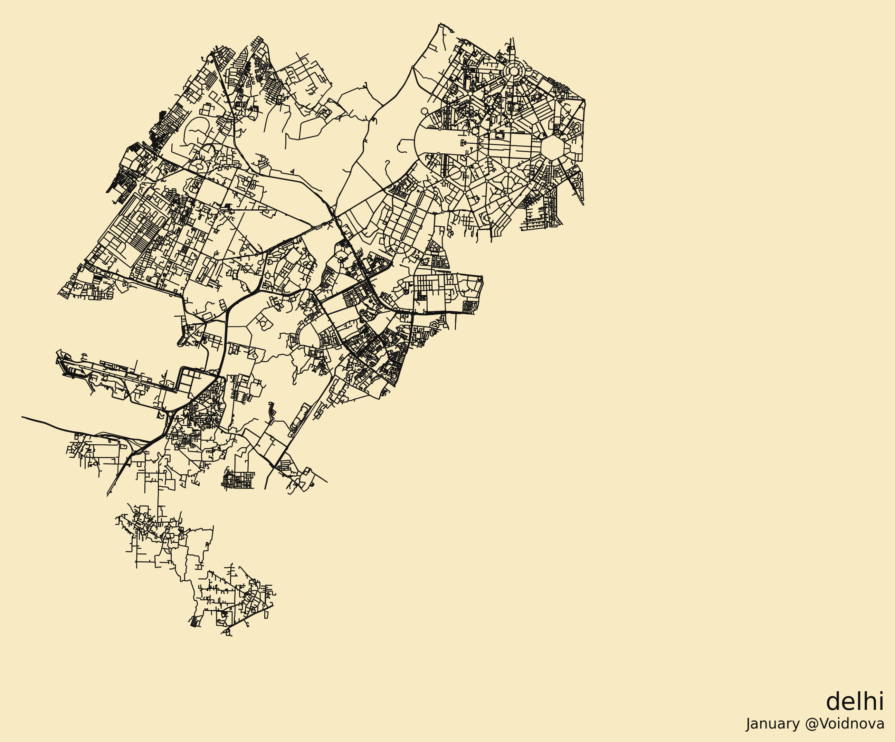

# Detailed Map Renderer

A Python script that renders a street map image for any city/state/country using OpenStreetMap data via OSMnx.

Performance-focused: to speed up generation and reduce memory usage on PCs, the renderer focuses on streets only. Non-street layers (water, parks/greens, buildings) have been removed. The street style and output format remain the same.

## Example output



## Usage

1. Install Python 3.9+.
2. Install dependencies:

```bash
pip install -r requirements.txt
```

Notes on dependencies:
- `osmnx` pulls OSM data and does graph plotting
- `matplotlib` renders the image
- `geopandas` supports geocoding/boundaries used by OSMnx
- `pillow` is used to flatten any transparent pixels so the background never appears black

3. Run the script (interactive or CLI):

```bash
# interactive
python bw_map.py

# or provide the place directly
python bw_map.py "Kolkata, West Bengal, India"
```

### White background
The map uses a light cream background by default.

To use a different background color, set `PYMAP_BG` to a hex color.

```powershell
$env:PYMAP_BG="#f8eac2"
python bw_map.py "Assam, India"
```

Enter a place like `Kolkata, West Bengal, India` or `San Francisco, CA, USA`. The generated image `map_detailed.png` will be saved in the current folder.

## Notes
- If the first attempt fails, try adding the country to the query for better geocoding accuracy.
- Output style: thin black streets on an off-white background. Non-street layers are intentionally omitted for performance.

### State-level maps
If you generate a whole state (very large area), OSMnx may warn that Overpass needs to split it into many sub-queries. That can still take time.

This script speeds state renders by:
- limiting to major roads for very large areas
- using OSMnx's fast graph plotting (lower CPU/RAM than GeoPandas plotting)

### Cache
The `cache/` folder is cleared after every run by default.

To keep the cache (faster repeated runs), set:

```bash
PYMAP_KEEP_CACHE=1
```

On Windows PowerShell:

```powershell
$env:PYMAP_KEEP_CACHE="1"
python bw_map.py "Assam, India"
```
